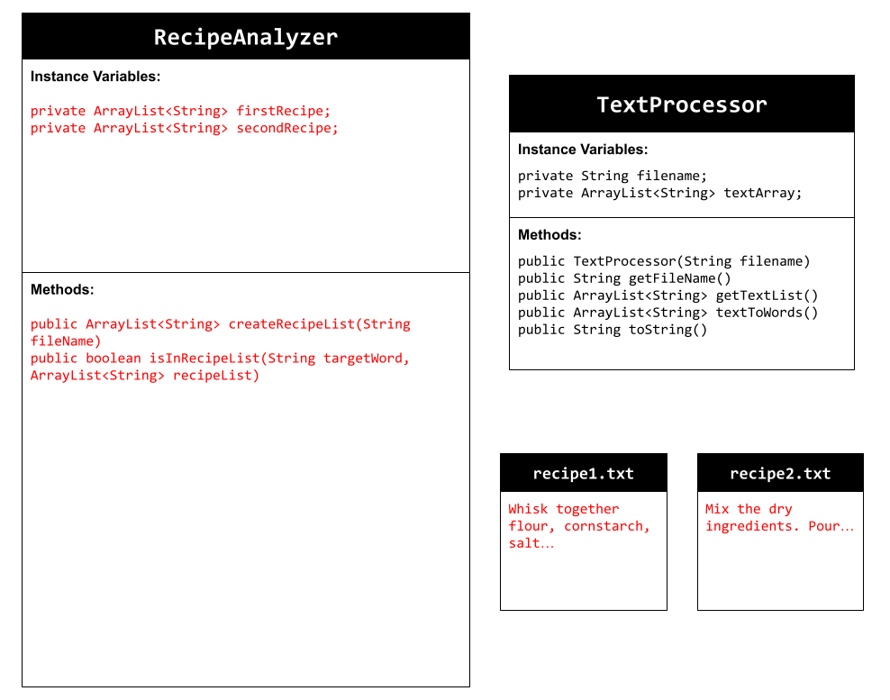

# Unit 6 - Natural Language Processing Project

## Introduction

Natural language processing (NLP) is used in many apps and devices to interact with users and make meaning of text to determine how to respond, find information, or to create new text. Your goal is to use natural language processing techniques to identify structure, patterns, and meaning in a text to have conversations with a user, execute commands, perform manipulations on the text, or generate new text.

## Requirements

Use your knowledge of object-oriented programming, ArrayLists, the String class, and algorithms to create a program that uses natural language processing techniques:

- **Create at least two ArrayLists** – Create at least two ArrayLists to store the data used in your program, such as data from text files or entered by the user.
- **Implement one or more algorithms** – Implement one or more algorithms that use loops and conditionals to find or manipulate elements in an ArrayList or String object.
- **Use methods in the String classs** - Use one or more methods in the String class in your program, such as to divide text into sentences or phrases.
- **Use at least one natural language processing technique** – Use a natural language processing technique to process, analyze, and/or generate text.
- **Document your code** – Use comments to explain the purpose of the methods and code segments and note any preconditions and postconditions.

## UML Diagram

## Video

## Project Description

My goal in this project is to find certain words in two different recipes. To be more specific, I looked up two different recipes and made them into .txt files: recipe1 and recipe2. My RecipeAnalyzer class uses NLP to traverse the .txt files and return what recipe the word is found in onto the console. If not, an error handle I made would be printed instead.

## NLP Techniques

My NLP technique is simple. The two recipes have words that I want to find. The NLP part of my code is the isInRecipeList() method, which traverses the .txt files to see if the enter by userInput is in one of the .txt files. Then, returns true or false if the word is/is not in the recipe .txt files. The prompt() method then uses System.out.println to prints the result as a custom string into the console.